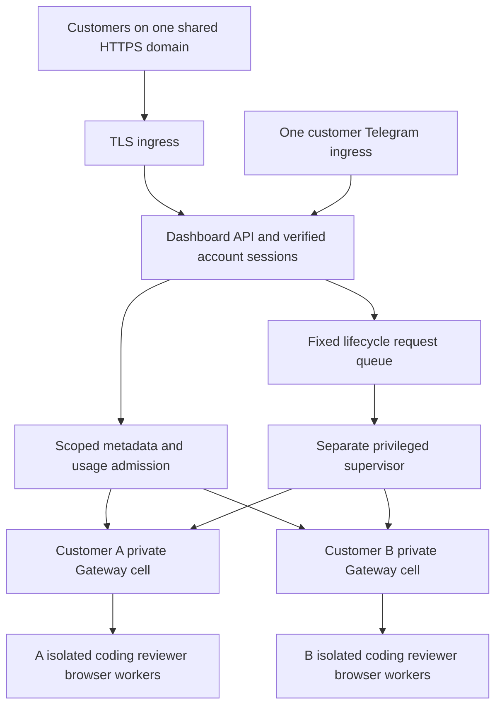

# Phase4 — one VPS, one domain, multiple hosted customers

**Historical assessment:** the default-cell measurements below are retained.
The 2026-09-30 owner direction selects an existing-server trial first, with
on-demand cells and serialized workers. An upgrade is now optional. See
[the current trial plan](../../../product/EXISTING_VPS_TRIAL.md). No smaller
working profile has yet been measured.

Assessment date:2026-09-29 PDT /2026-09-30 UTC. Target clarified by owner during
Phase4. **One service-operated VPS + one shared public domain. Customers supply
neither servers nor domains.** No public route or customer agent was activated.

## What the existing architecture supports

The customer product already assumes hosted signup/dashboard/Telegram, server-side
account ownership and account→deployment routing. One TLS origin can serve all
customers; internal agent cells need no public subdomain, customer domain or
customer-operated machine. Account records/projects/tasks are independently
scoped in the Phase2/3 metadata layer. These are implemented and targeted-tested;
SMTP/TLS onboarding itself is not activated.

The infrastructure decision **ADR002** in `platform/ARCHITECTURE.md` selected a
separate service-owned VM per customer, repeated in `product/CONTRACT.md` and the
Phase1 cost worksheet. That choice exceeded the customer's supplied-infrastructure
requirements; it was never a requirement for customers to buy/operate VMs.
The current model has no completed lifecycle driver: `DisabledLifecycle` still
refuses operations. Single-VPS cell provisioning is consequently **not already
implemented**. The unfinished VM-specific draft from this Phase4 turn was
withdrawn before integration/migrations after the clarification. Phase3 auth and
its shipped schema remain unchanged.

## Proposed single-VPS architecture



1. **Complete Gateway per account:** native Fleet cell/container, independent
   process, mounts, account memory/chat/workspace/artifact roots, auth store and
   random Gateway token. Different native sessions inside one shared Gateway
   cannot supply customer isolation. Fleet is experimental; pin installed version,
   immutable image and tested config schema. Current2026.9.6 CLI supports create,
   start, stop, upgrade, backup, restore, rm/status/doctor with resource flags.
2. **One public app origin:** reverse proxy only the dashboard API. All Gateways,
   broker, model proxy and databases remain private; account routes resolved on
   the server, never selected by client tenant/URL/Gateway token. No additional
   customer domains are necessary. Host/operator is a disclosed trusted party.
3. **Isolated workers:** coding, debugging, reviewing and browser processes must
   run within account-specific sandboxes and resource budgets. Worker mounts
   contain only their project/artifact files, with reviewer read-only access;
   no Gateway auth DB, provider secrets, other-cell state or shared owner OAuth.
   Native sandbox mode alone does not prove host-side Codex/ACP isolation.
   Gateway containers receive no Docker socket. A fixed privileged supervisor
   may create workers; no shell/path/mount/env/image choice from customer input.
   Fleet alone does not implement this worker broker. It is missing build work.
4. **Host isolation:** distinct host identities/user namespaces and private
   filesystem roots, dropped capabilities, no-new-privileges, seccomp/AppArmor,
   separate network namespace/bridge. For this arbitrary app-building offer,
   evaluate **gVisor runsc** (or tested equivalent) for tenant code/workers and
   preferably Gateways. Native containers share a kernel; no claim of VM-level
   separation or resistance to a compromised host. gVisor is a candidate, not
   installed/proven compatibility with this OpenClaw/browser/Codex stack.
   Do not silently fall back to standard runtime for an incompatible worker.
5. **Network:** bridges alone do not enforce the required destination policy.
   Block cross-cell routes, owner/control/metadata/private addresses, cloud
   metadata and proxy credentials; allow intended provider/web destinations
   through a narrow authenticated proxy. Docker Fleet `--network internal` is
   rejected because it breaks loopback publishing; use explicit host firewall
   policy, or evaluate Podman internal networking. Neither is configured here.
6. **Credentials/budgets:** unique Gateway token and independently enforceable
   provider virtual key/budget for every account; no shared owner keys/login
   custody. Separate control, app and workload identities. Phase5 must meter/
   reserve every provider route, including coding/review, before task execution.
7. **Resource admission:** per-account aggregate cgroup for Gateway + every worker,
   CPU/RAM/PIDs/swap/disk ceilings and one running task/account. Start beta with
   a proposed **global limit of one running task** so queued users share active
   capacity safely. This is an additional proposed host ceiling, not a changed
   $79/$25/$5 offer. Reserve all inflight/starting/restore/upgrade resources and
   preserve the owner service envelope. Unknown/stale peaks deny admission.
8. **Persistent disk:** OS/filesystem-enforced caps for state/workspaces/caches/
   artifacts, plus writable-layer limits. Product2GiB artifact quota is not an OS
   filesystem quota. Fleet's `--disk` covers writable layers only and depends on
   compatible backing storage; binds need independent limits. Test ENOSPC and
   ensure customer A cannot exhaust host or B. No Docker/storage conversion was
   performed on the owner daemon.
9. **Lifecycle:** durable account-bound operation ID/idempotency/generation,
   fenced leases, reconciliation before retry, fixed actions. Upgrade pinned
   bytes after per-cell backup/compatibility/health with scoped rollback. Restore
   a quarantined **temporary cell on this VPS**, separate roots/network/credentials,
   with outbound/jobs off; reserve its extra RAM/disk first. B must remain intact.
   Reconcile usage/key identity before any resume. Deletes revoke keys, observe
   contract grace/retention and remove only registered exact cell roots.

Primary support: [native Fleet](https://docs.openclaw.ai/cli/fleet),
[OpenClaw multi-tenant trust boundary](https://docs.openclaw.ai/gateway/multi-tenant-hosting),
[Docker resource controls](https://docs.docker.com/engine/containers/resource_constraints/),
[Docker rootless](https://docs.docker.com/engine/security/rootless/),
[gVisor architecture/compatibility](https://gvisor.dev/docs/).
Fleet `--runtime docker|podman` selects the engine, **not** gVisor. A stronger OCI
runtime is a host-engine configuration/integration decision that needs a probe.

## Existing VPS: measured snapshot, not a load benchmark

Read-only3 samples, owner workloads untouched:

| Observation | Value | Consequence |
|---|---|---|
| CPU |2vCPU | Sustained owner+tenant+builder/browser peaks unmeasured |
| Physical RAM |3.78GiB (~4GiB plan) | Small shared budget |
| Available RAM |0.94–0.97GiB | Current owner footprint already dominates |
| Swap |2GiB, free about7.6MiB | Over99% occupied; no spare swap capacity |
| Owner Gateway |1.36–1.40GiB RSS reported by Docker | Do not substitute empty Gateway estimates |
|5 existing browser containers |About876MiB total | Potentially reclaimable only after safe idle/owner review; none stopped |
| Model proxy/Postgres |About122MiB/41MiB | Existing fixed services preserved |
| Root disk free |About82.8GiB | Space currently available; tenant quotas still missing |
| Runtime |`runc`, AppArmor/builtin seccomp, cgroupv2 | gVisor/Podman not installed; rootless tenant setup unproven |
| Backing mount |ext4, no project-quota option reported; Docker `overlayfs` | Fleet writable-layer/persistent quota compatibility unproven |
| `/dev/kvm` |Present | Possible nested-VM alternative, not a tested working VM or capacity gain |
| Public app |No80/443 listener in inspected snapshot | DNS/TLS/app routing not installed |

Reproducible RAM bound:

```
min available                   1,014,509,568 bytes
planned app/broker reserve        268,435,456 bytes (256MiB)
planned safety headroom           536,870,912 bytes (512MiB)
remaining                        209,203,200 bytes (~200MiB)
Fleet default cell cap         2,147,483,648 bytes (2GiB)
RAM slots = floor(remaining / cell cap) = 0
```

The reserves are proposed conservative bounds, not measured product-service
peaks. Even with no reserves, available RAM is below one default2GiB Fleet cell.
That is before separate coding/browser/reviewer or restore/upgrade overlap.
Docker CPU snapshots are not CPU admission measurements; disk/PID envelopes and
customer-task peaks are unknown. The read-only calculator returns **0 admitted
agent deployments** from memory and unverified isolation/peaks. It does not
start/stop/reserve resources, replace Phase5 admission or claim server load proof.

**The VPS can support product/account development, but current evidence does not
support enabling the complete agent offer for even one added beta customer.**
Removing confirmed-unused browser containers could recover some memory, but it
is neither authorized nor sufficient evidence of safe complete-task capacity.
Cleaning image caches frees disk rather than the required RAM. Lowering Gateway
limits blindly risks OOM failures instead of producing a verified beta capacity.

## Concrete small-beta proposal on one VPS

Keep the same hosted product/domain. Upgrade the service-operated VPS to a
**16GiB RAM /4vCPU planning target**, retain the existing maximum **two beta
accounts**, and begin with **one globally running task**. This is not a purchased
upgrade, price quote or measured supported capacity.

Illustrative allocation:4GiB owner envelope +0.5GiB product services +2GiB safety
+4GiB for two2GiB Gateway caps +3GiB for one active worker set = **13.5GiB**,
leaving2.5GiB. Owner/worker/CPU peaks, stronger-runtime overhead and restore overlap
must be measured; deny work if any peak/envelope cannot fit. This scenario shows
why16GiB is a concrete candidate rather than claiming two real tasks fit today.
The full offer beside the existing owner services is not justified on8GiB by
this conservative allocation. An idle-account sleep policy could reduce footprint
later after measured wake/reconnect behavior; no sleeping-cell optimization exists.

Upgrade is one possible resolution. Alternatively move owner workloads off this
VPS, or temporarily narrow beta task features, then remeasure and update the
contract explicitly. The current request is for the complete offer; no task scope
or existing owner workload was reduced during assessment. Invoice/upgrade cost
is unknown; pricing79USD/month and included/provider/task limits remain unchanged.

## Phase4 disposition and remaining work

- Architecture/capacity assessment: READY;7 focused calculator checks PASS.
- Lifecycle/worker implementation: **PARTIAL/MISSING**, no completed native driver
  or live cell. No A/B runtime isolation acceptance claimed.
- Customer provisioning/agent activation: **BLOCKED** until headroom, runtime/
  worker/storage/network/budget prerequisites and targeted boundary proof exist.
- Full live concurrency/restore/failure/load/security acceptance: NOT_RUN Phase15.
- VM-specific draft removed locally; no migration/database/deployment effect.
  Phase3 source hashes verified unchanged for restored files.
- Automatic approval review rejected whole installed runtime source copying as
  internal source egress. CLI help + official docs sufficed for this assessment;
  no bypass. Native flags/help read-only, no lifecycle action/model call ran.

Single-VPS implementation sequence for a resumed Phase4: (1) prepare/measure
host upgrade and budgets without activating customers; (2) isolate supervisor/
runtime identities and hard volumes/networks; (3) implement the durable Fleet
adapter + worker broker with pinned capabilities; (4) run disposable A/B local
OS/container denial and retry tests; (5) retain execution gate through Phase5
admission and Phase15 acceptance. No Phase5 execution is authorized by this report.
